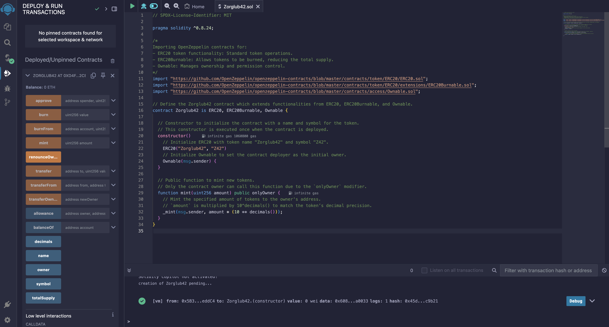

# Deployment Instructions for Zorglub42 Contract

## **Pre-Requisites**

- **Install MetaMask:**
   - Install the [MetaMask browser extension](https://metamask.io/).
   - Set up a **MetaMask wallet** by following the instructions provided on the MetaMask site.

- **Connect to Sepolia:**
   - Ensure that you are connected to **Sepolia network** (if Sepolia is not showing, toggle `Show test networks`).
   - Ensure your MetaMask wallet had enough **Sepolia ETH** to cover the gas fees for deploying a contract (≈ 0.02) and do some transactions. You can obtain up to 0.05 Sepolia ETH per day from this [Sepolia faucet](https://cloud.google.com/application/web3/faucet/ethereum/sepolia). Note that Sepolia ETH has no real value.

## **Contract Deployment**

### **1. Open Remix IDE**
   - Go to [Remix IDE](https://remix.ethereum.org/).

### **2. Create a New Solidity File**
   - In the **File Explorer** tab, select the `contracts/` folder and either right-click on the foler and select "New File", either directly click on the "New File" button.
   - Name the newly created file `Zorglub42.sol`

### **3. Paste Contract Code**
   - Copy and paste the contents of the file `Zorglub42.sol` located in the folder `code/` at the root of this repository in Remix.
   

### **4. Compile the contract**
   - Go to the **Solidity Compiler** tab.
   - Make sure that the compiler version is the same as the one indicated in the `Zorglub42.sol` file (here 0.8.26)
   - Click on `Compile Zorglub42.sol`
   
   - If all went well, a green ✅ should have appeard on the tab logo. Otherwise don't hesitate to check the logging at the bottom of the page to troubleshoot any issues.

### **5. Deploy the contract**
   - Go to the **Deploy & Run Transactions** tab
   - Select "**Injected Provider - MetaMask**" in the environment selector. This will ensure the contract is deployed with your MetaMask account.
   - Ensure MetaMask is connected to the **Sepolia Network** and that `Zorglub42` is the contract being deployed by checking the value in the contract selector.
   - Click on `Deploy` and confirm the transaction in MetaMask.
   
   - If all went well, your contract shoud have appeared under the **Deployed/Unpinned Contracts** section.

### **6. Interact with the contract**
* #### Newly deployed contract
  - After deployment, **save the contract address** from the Remix console output in a text editor. This will allow you to interact with the contract in the future.
  - Scroll down to the **Deployed/Unpinned Contracts** section and select your deployed contract from the dropdown list.
  - You can now interact with the contract by using the available functions (e.g `mint`, `balanceOf`...) ! Don't forget to pass them the required parameters if needed and to confirm any transactions in MetaMask or directly in the [Sepolia explorer](https://sepolia.etherscan.io/) by providing the contract address that you retrieved previously
  
  - Keep in mind that **orange functions** are functions that modify the blockchain state and require computational work by the network, therefore they **require gas fees**. The **blue functions** are read-only function, meaning they do not modify the blockchain state and therefore **do not require gas fees**.
- #### Previously deployed contract
  - Locate the **address of the previously deployed contract** you want to interact with. You should have this from the deployment output in Remix or from the [blockhain explorer](https://sepolia.etherscan.io/). If you've lost the address, you can find it by:
    - Going to MetaMask.
    - Selecting the account with which you deployed the contract.
    - Clicking on the three vertical dots.
    - Clicking on "View on explorer."
    - Copying the corresponding "Contract Creation" value.
  - Make sure MetaMask is set to the network where your contract was deployed (here Sepolia)
  - **Repeat steps 1 to 4** (in order to interact with a deployed contract, you need not only its address but also the compiled source *.sol file)
  - Go tho the **Deploy & Run Transactions** tab
  - Select "Injected Provider - MetaMask" as the environment to use MetaMask
  - Make sure `Zorglub42.sol` is the selected contract.
  - This time **do not click on `Deploy` !** Instead paste the contract's address in `At Address` and click on the corresponding button.
  
  - Scroll down to the **Deployed/Unpinned Contracts** section
  - You can now interact with your previously deployed contract instead of deploying a new one !
  
  
## **Troubleshooting**
- **Contract not found**: Ensure you're on the correct network and using the correct contract address
- **Gas Fees**: Ensure you have enough ETH in your wallet to cover the gas fees for the transaction.
- **Unexpected function behaviour**: if you've deployed multiple contracts with the same nam (through Remix VM or MetaMask), make sure you are interacting with the righ version in the **Deployed/Unpinned Contracts**

 

